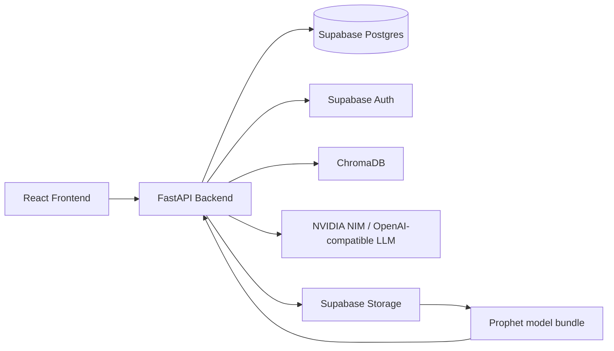
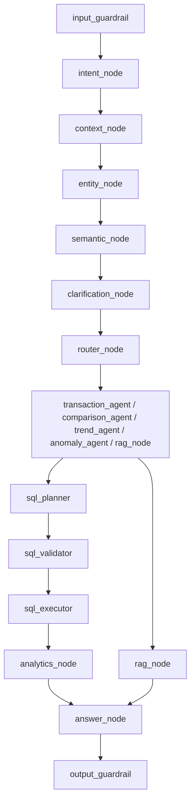

# FinAssist Technical Evaluation Prep

This guide is meant to help you explain the project end to end in a confident, structured way.

## 1. One-line project summary

FinAssist is a personal finance platform that combines:

- A React frontend for dashboard, transactions, budgets, goals, investments, and AI chat.
- A FastAPI backend that exposes CRUD APIs and AI/forecasting endpoints.
- Supabase for auth, relational data, and storage.
- A LangGraph-based assistant for safe, stateful financial Q&A.
- A Prophet-based forecasting pipeline for spending prediction.
- A statement ingestion pipeline for PDF/CSV uploads and transaction extraction.

If someone asks "what does the app do?", you can say:

> It helps users manage accounts, transactions, budgets, goals, statement uploads, forecasting, and AI-based finance advice in one workflow.

## 2. High-level architecture

## 3. Stack and why it was used

### Frontend

- React + Vite: fast local dev, component-based UI, easy page composition.
- TypeScript: makes API payloads and state contracts safer.
- Context API (`AppContext`): centralizes shared user, transaction, account, budget, goal, and forecast state.
- `apiFetch`: forces no-cache network behavior for fresh finance data.

### Backend

- FastAPI: strong fit for typed APIs, request validation, and async-friendly endpoints.
- Pydantic schemas: make request/response shape explicit.
- Supabase client: direct access to Postgres tables, auth, storage, and RPC functions.

### AI and analytics

- LangGraph: used because the chatbot is not a single prompt. It is a multi-step workflow with routing, guardrails, context rewrite, entity extraction, clarification, SQL generation, analytics, RAG, and final answer generation.
- NVIDIA NIM / OpenAI-compatible API: powers intent classification and LLM-based reasoning.
- ChromaDB: local vector retrieval for finance knowledge.
- Prophet: used for spend forecasting because it is explainable and works well for time series trend projection.

### Statement ingestion

- PDF/text extraction libraries: parse bank statements.
- Background processing: avoids blocking the request while parsing large files.
- Merchant normalization and categorization: improves transaction quality and consistency.

## 4. Frontend structure

### Entry points

- `frontend/src/main.tsx` mounts the app.
- `frontend/src/App.tsx` wraps the app in `AppProvider`.
- `frontend/src/components/Layout.tsx` decides which page to show based on `currentPage`, auth state, and onboarding state.

### Core state manager

`frontend/src/context/AppContext.tsx` is the real frontend orchestrator.

It does four important things:

1. Restores auth from local storage.
2. Detects OAuth redirect tokens and calls the backend to sync the user.
3. Loads data from backend APIs.
4. Updates the backend when UI changes happen.

### Important frontend helpers

- `frontend/src/lib/api.ts`
  - Builds API URLs for `http://localhost:8000`.
  - Forces `cache: 'no-store'`.
- `frontend/src/lib/authSession.ts`
  - Saves and restores user session in `localStorage`.
- `frontend/src/lib/activeUserId.ts`
  - Normalizes `userId` or `id` to one active backend user id.

## 5. Frontend data loading pattern

The frontend does not let each page talk to the backend in a random way. It uses `AppContext` as a single source of truth.

Typical flow:

1. Page mounts.
2. It calls a context loader like `loadDashboardSummary`, `loadTransactions`, `loadForecast`, or `loadAccountHubAnalysis`.
3. The loader calls a backend API endpoint.
4. The response is stored in context state.
5. Any component consuming that context re-renders.

That is why this app feels coordinated instead of every page being isolated.

## 6. Backend entry point

`backend/app/main.py`

This file:

- Creates the FastAPI app.
- Adds CORS for the frontend dev origins.
- Disables API caching on `/api/*`.
- Includes routers for:
  - `api`
  - `statement_parser`
  - `chatbot`
  - `forecasting`
  - `admin`
  - `internal`
- Reloads forecast models on startup when enabled.

That means the backend is the central gateway for all app features.

## 7. Backend layer breakdown

### A. Auth and user sync

Relevant files:

- `backend/app/routes/api.py`
- `backend/app/services/user_profile_service.py`
- `backend/app/utils/supabase_client.py`
- `sql/auth_users_rls_migration.sql`

Why it exists:

- Supabase Auth manages login/signup.
- Public tables like `users` and `user_profiles` keep application data.
- The backend syncs Auth users to those public tables using service-role access.

Important logic:

- `api_login` and `api_register` call Supabase Auth.
- `ensure_user_with_profile()` creates or fetches rows in `users` and `user_profiles`.
- `oauth-login` handles OAuth redirect users and self-heals mismatched user ids.

Why not use only client-side auth?

- Because the backend needs stable service-role access for data sync and server-side operations.
- Client-only auth would make secure table maintenance and admin tasks harder.

### B. Dashboard and financial summary

Relevant files:

- `backend/app/routes/api.py`
- `backend/app/services/dashboard_metrics_service.py`
- `backend/app/services/accounts_service.py`
- `backend/app/services/account_hub_analysis_service.py`

Endpoints:

- `GET /api/dashboard-summary`
- `GET /api/budget-goals-summary`
- `GET /api/account-hub-analysis`

What happens:

1. Backend fetches user accounts, transactions, budgets, and profile income.
2. It builds summary metrics like total balance, monthly income, expenses, savings rate, chart data, expense breakdown, and recent transactions.
3. The account hub analysis optionally calls an LLM for insights on credit utilization and spending patterns.

Why this design is good:

- It keeps chart and summary logic on the server, so the frontend receives ready-to-render data.
- It avoids duplicating finance math in the browser.

### C. Transaction CRUD

Relevant files:

- `backend/app/routes/api.py`
- `backend/app/services/transaction_service.py`

Endpoints:

- `POST /api/transactions`
- `GET /api/transactions`
- `PUT /api/transactions/{trans_id}`
- `DELETE /api/transactions/{trans_id}`

Core logic:

- Amounts are stored as positive magnitudes.
- `transaction_type` decides sign and balance direction.
- `create_transaction_record()` resolves or creates the account, resolves the category, inserts the transaction, and updates the account balance.
- `update_transaction_record()` reverses the old balance impact before applying the new one.
- Merchant overrides are upserted into `user_category_overrides` so future statement parsing gets smarter.

This is an important interview point:

> The balance is not calculated in the UI. It is enforced in backend service logic so the source of truth stays in the database.

### D. Budgets and goals

Relevant files:

- `backend/app/routes/api.py`
- `backend/app/services/dashboard_metrics_service.py`

Endpoints:

- `GET /api/budgets`
- `POST /api/budgets`
- `PUT /api/budgets/{budget_id}`
- `DELETE /api/budgets/{budget_id}`
- `GET /api/goals`
- `POST /api/goals`
- `PUT /api/goals/{goal_id}`
- `DELETE /api/goals/{goal_id}`

Important behavior:

- Budgets are linked to categories.
- The backend resolves a category id by category name.
- Monthly budgets are normalized to the full calendar month so spend from the first day still counts.
- Goals can auto-populate current amount from net savings if the caller sends zero.

### E. Forecasting

Relevant files:

- `backend/app/routes/forecasting.py`
- `backend/app/services/forecast_service.py`
- `backend/app/services/forecast_features.py`
- `backend/app/services/prophet_training_service.py`
- `backend/app/services/model_storage_service.py`

Endpoints:

- `GET /api/forecast`
- `GET /api/forecast/models`
- `GET /api/forecast/model-status`
- `POST /api/forecast/reload-model`

Forecast flow:

1. API fetches transaction history and categories.
2. `generate_forecast()` filters to expense rows and applies optional filters like account, category, and merchant.
3. Feature engineering aggregates expense data by week or month.
4. Prophet predicts the next month spend.
5. The response includes chart data, top categories, merchants, heatmap, outlier detection, recurring spend, and budget alert logic.

Why Prophet here:

- It is explainable.
- It works well for time-based forecasting.
- It is easier to justify in an evaluation than a black-box model.

Training flow:

- Nightly cron triggers `POST /api/internal/train-forecast`.
- Training reads expense data from Supabase.
- A global monthly Prophet model is trained.
- The model is saved locally, then uploaded to Supabase Storage.
- The backend reloads the model into memory.

### F. AI assistant and LangGraph

Relevant files:

- `backend/app/routes/chatbot.py`
- `backend/app/graph/graph.py`
- `backend/app/graph/state.py`
- `backend/app/graph/edges.py`
- `backend/app/graph/nodes/*`
- `backend/app/graph/sql/*`
- `backend/app/utils/chroma_store.py`

Endpoint:

- `POST /api/chat/message`

This is the most important "deep backend" story.

The assistant is not one prompt. It is a graph of steps:

What each node does:

- `input_guardrail`
  - Blocks prompt injection, suspicious data access prompts, profanity, and other unsafe inputs.
- `intent_node`
  - Classifies the message into one of the financial intents.
- `context_node`
  - Rewrites follow-up questions using conversation history.
- `entity_node`
  - Extracts merchants, categories, dates, and other structured entities.
  - Uses pure Python date resolution before LLM extraction.
- `semantic_node`
  - Maps extracted names to real database values.
- `clarification_node`
  - Decides whether the query is ambiguous and needs a follow-up question.
- `router_node`
  - Chooses the correct agent path.
- `goal_planning_node`
  - Handles slot filling for financial goal planning.
- `workflow_relevance_node`
  - Checks whether the current message still belongs to an active workflow.
- `rag_node`
  - Searches ChromaDB, then falls back to live web search if retrieval confidence is weak.
- `sql_planner`
  - Converts AST to SQL.
- `sql_validator`
  - Blocks non-SELECT operations, unknown tables, missing user scoping, and forbidden keywords.
- `sql_executor`
  - Executes validated SQL via Supabase RPC or falls back to query builder logic.
- `analytics_node`
  - Computes totals, trends, comparisons, anomalies, category splits, and merchant splits.
- `answer_node`
  - Generates the final response using LLM and injected context.
- `output_guardrail`
  - Masks PII and blocks dangerous outputs before returning the answer.

Why LangGraph instead of a single chat function?

- Because the assistant needs branching behavior.
- Some queries need SQL.
- Some need knowledge retrieval.
- Some need clarification.
- Some are follow-up replies to an active goal-planning workflow.
- A graph makes this visible and testable.

### G. Statement parser / upload pipeline

Relevant files:

- `backend/app/routes/statement_parser.py`
- `backend/app/services/statement_processor/pipeline.py`
- `backend/app/services/statement_processor/background_worker.py`
- `backend/app/services/statement_processor/db_persistence.py`
- `backend/app/services/statement_processor/validator.py`

Endpoints:

- `POST /api/statement/parse-text`
- `POST /api/statement/parse-file`
- `POST /api/statement/upload`
- `POST /api/statement/ingest`
- `GET /api/statement/jobs/{job_id}`
- `GET /api/statement/uploaded-statements`

There are two statement flows:

#### 1. Preview flow

- Frontend sends a PDF/CSV to `/api/statement/parse-file`.
- Backend extracts text, detects bank, parses transactions, normalizes merchants, and categorizes them.
- The response is returned without DB write, so the user can preview transactions.

#### 2. Persist flow

- Frontend posts the parsed transaction JSON to `/api/statement/ingest`.
- Backend resolves or creates the account.
- It inserts transactions in batches.
- It calls the `sync_account_balance` RPC to update account balance atomically.

Async upload flow:

- `/api/statement/upload` creates an `uploaded_statements` row and a `processing_jobs` row.
- Background worker runs the full pipeline.
- Progress is written back to the database.
- Duplicate uploads are blocked using a file hash.

Pipeline steps in `StatementPipeline.run_pipeline()`:

1. Extract text from statement file.
2. Detect bank format.
3. Extract account metadata.
4. Resolve or create account.
5. Extract transactions.
6. Normalize merchants.
7. Categorize transactions.
8. Remove duplicates.
9. Persist rows and sync balance.

Why this design matters:

- Preview and persistence are separated.
- Large uploads do not block the request thread.
- Duplicate file prevention protects the database from repeated imports.

### H. Admin and internal training

Relevant files:

- `backend/app/routes/admin.py`
- `backend/app/routes/internal.py`
- `backend/app/services/model_training_service.py`
- `backend/app/services/model_monitoring_service.py`

Admin routes cover:

- training jobs
- model evaluation
- drift and performance
- staging / deployment

Internal routes cover:

- cron-triggered forecast retraining

Why separate admin/internal routes:

- Admin routes are protected by admin auth.
- Internal routes are protected by a cron secret.
- This keeps sensitive model maintenance away from public API users.

## 8. Data layer

### Key tables used by the app

- `users`
  - Application-level user identity and role.
- `user_profiles`
  - Onboarding and financial profile data.
- `accounts`
  - User-linked bank or card accounts, balances, and metadata.
- `transactions`
  - Financial ledger entries.
- `categories`
  - Main and sub categories.
- `budgets`
  - User budget limits and periods.
- `goals`
  - Savings or financial goals.
- `investments`
  - Mutual fund holdings ledger.
- `uploaded_statements`
  - Tracks file uploads and deduplication hashes.
- `processing_jobs`
  - Background parsing job progress.
- `merchant_master`
  - Canonical merchant normalization reference.
- `user_category_overrides`
  - User-specific category corrections for merchants.
- `forecast_model_runs`
  - Metadata for trained model runs.

### Important DB behaviors

- `sql/auth_users_rls_migration.sql`
  - Creates a trigger so Auth signup automatically provisions `users` and `user_profiles`.
  - Enables RLS for user-owned rows.
- `supabase/migrations/20260603100000_sync_account_balance_rpc.sql`
  - Adds an atomic RPC to update account balances.
- `supabase/migrations/20260602220000_bank_statement_processing.sql`
  - Adds statement upload tables, merchant master, overrides, and statement metadata columns.
- `supabase/migrations/20260602120000_accounts_credit_limit.sql`
  - Adds credit limit support for credit card analysis.
- `supabase/migrations/20260530180000_forecast_models_storage.sql`
  - Adds private storage for model artifacts and run metadata.
- `supabase/migrations/20260530190000_train_forecast_cron.sql`
  - Schedules nightly retraining.

### Why service-role Supabase access is used

`backend/app/utils/supabase_client.py` creates two clients:

- auth client for login/signup
- database client for table access and sync

That separation is important because using one client for everything can break auth/RLS behavior after sign-in.

## 9. End-to-end flows you should be able to explain

### Flow 1: Login and onboarding

1. User logs in or signs up on the frontend.
2. Frontend stores session in localStorage.
3. Backend authenticates via Supabase Auth.
4. Backend ensures `users` and `user_profiles` exist.
5. Frontend routes user to onboarding if needed.
6. Onboarding updates profile fields through `PUT /api/users/{user_id}`.

### Flow 2: Dashboard

1. Dashboard mounts.
2. `loadDashboardSummary()` calls `GET /api/dashboard-summary`.
3. Backend gathers accounts, transactions, budgets, and profile income.
4. Backend computes summary cards, charts, expense breakdown, budget utilization, and recent transactions.
5. Dashboard renders all widgets from that single payload.
6. It separately calls `GET /api/account-hub-analysis` for account insights.

### Flow 3: Add or edit transaction

1. User submits transaction modal.
2. Frontend calls `POST /api/transactions` or `PUT /api/transactions/{id}`.
3. Backend resolves category and account.
4. Backend updates transactions and account balance.
5. Frontend reloads transactions, dashboard summary, and budget/goals summary.

### Flow 4: Statement upload

1. User uploads a statement file.
2. Frontend first calls `/api/statement/parse-file` to preview parsed transactions.
3. If accepted, frontend calls `/api/statement/ingest`.
4. Backend writes the rows in batch and syncs the account balance.
5. Frontend refreshes transactions and accounts.

### Flow 5: AI chat

1. User sends a message from the AI assistant page.
2. Frontend calls `POST /api/chat/message`.
3. Backend builds a real-time user profile from Supabase data.
4. LangGraph routes the query through guardrails, intent, context, entity extraction, routing, RAG or SQL, analytics, answer generation, and output guardrail.
5. Final answer is returned to the UI.

### Flow 6: Forecasting

1. Forecast page calls `loadForecast()`.
2. Frontend hits `GET /api/forecast`.
3. Backend fetches transaction history and categories.
4. Forecast service applies feature engineering and Prophet prediction.
5. Backend returns chart data, predicted next month, top categories, merchants, and insights.

## 10. Why these choices instead of others

### Why FastAPI?

- Strong request validation.
- Clean separation of routers/services.
- Good fit for Python-based ML and data processing.

### Why not put all logic in the frontend?

- Finance logic needs a secure server-side source of truth.
- Balance updates and category mapping must not be inconsistent across clients.
- Forecasting and AI need backend access to data and model storage.

### Why Supabase?

- Built-in auth.
- Postgres relational schema.
- Storage for model artifacts.
- RPC support for atomic operations.
- Easy fit for a product that needs both app data and auth.

### Why LangGraph?

- The chatbot is a workflow engine, not just an LLM call.
- It needs routing, memory, guardrails, validation, and multiple specialized paths.

### Why Prophet?

- Simple to explain.
- Good for trend-based forecasting.
- Safer for business explanation than a black-box deep model.

### Why ChromaDB?

- Fast local vector retrieval.
- Good for RAG-style finance knowledge responses.

## 11. What to say if they ask about code quality

You can say:

- "The frontend uses a centralized context so data is not duplicated across pages."
- "The backend uses service functions to keep route handlers thin."
- "Transaction balance logic is enforced in the backend, not the UI."
- "The AI assistant is layered with guardrails, routing, SQL validation, and output filtering."
- "Forecasting is separated into feature engineering, training, storage, and inference."
- "Statement ingestion is split into preview, ingest, and async processing to keep the UX responsive."

## 12. Short speaking script

If you want a clean 60-second explanation:

> FinAssist is a full-stack personal finance app built with React, FastAPI, and Supabase. The frontend uses a shared context to load dashboard, transactions, budgets, goals, forecasting, and AI data from the backend. The backend keeps the financial logic in services, so things like balance updates, category mapping, budget utilization, and forecast generation stay consistent. The AI assistant is implemented with LangGraph so it can route between guardrails, intent classification, context rewriting, entity extraction, SQL analytics, and knowledge retrieval. For statement uploads, the app supports both preview parsing and background ingestion with duplicate detection and balance sync. Forecasting uses a Prophet model trained from transaction history and stored in Supabase Storage. 

## 13. Files worth opening before the evaluation

- `backend/app/main.py`
- `backend/app/routes/api.py`
- `backend/app/routes/chatbot.py`
- `backend/app/graph/graph.py`
- `backend/app/graph/state.py`
- `backend/app/graph/nodes/guardrail_node.py`
- `backend/app/graph/nodes/intent_node.py`
- `backend/app/graph/nodes/context_node.py`
- `backend/app/graph/nodes/entity_node.py`
- `backend/app/graph/nodes/semantic_node.py`
- `backend/app/graph/nodes/clarification_node.py`
- `backend/app/graph/nodes/router_node.py`
- `backend/app/graph/nodes/goal_planning_node.py`
- `backend/app/graph/nodes/rag_node.py`
- `backend/app/graph/nodes/answer_node.py`
- `backend/app/graph/sql/sql_validator.py`
- `backend/app/graph/sql/sql_executor.py`
- `backend/app/services/transaction_service.py`
- `backend/app/services/dashboard_metrics_service.py`
- `backend/app/services/statement_processor/pipeline.py`
- `frontend/src/context/AppContext.tsx`
- `frontend/src/views/Dashboard.tsx`
- `frontend/src/views/Transactions.tsx`
- `frontend/src/views/AIAssistant.tsx`
- `frontend/src/views/Forecasting.tsx`

## 14. The most important mental model

Keep this in your head:

> UI state is a cache, backend services are the source of truth, Supabase is the data layer, LangGraph is the AI workflow engine, and Prophet is the forecasting engine.

If you can explain that cleanly, you will sound like you understand the whole project.
