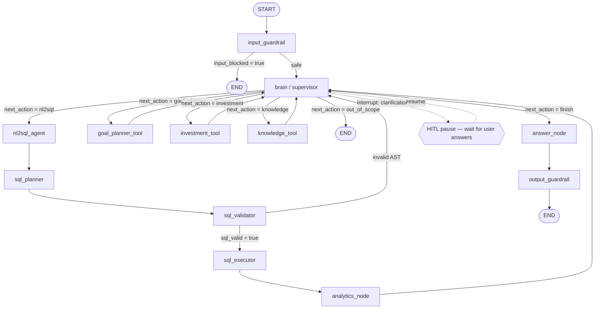

# FinAssist — LangGraph Flow (Brain / Supervisor Graph)

This document describes the full LangGraph `StateGraph` that powers the FinAssist AI
assistant: every node, what it does, and how control flows between them.

> Source of truth: [`backend/app/graph/graph.py`](../backend/app/graph/graph.py),
> [`backend/app/graph/edges.py`](../backend/app/graph/edges.py),
> [`backend/app/graph/state.py`](../backend/app/graph/state.py).

---

## 1. High-level shape

```
START → input_guardrail → brain ⇄ { nl2sql_agent → sql_planner → sql_validator → sql_executor → analytics_node
                                    | goal_planner_tool
                                    | investment_tool
                                    | knowledge_tool }
      → (brain decides "finish") → answer_node → output_guardrail → END
```

The **Brain (Supervisor)** is the orchestrator. On each pass it inspects the request,
conversation history, profile, and accumulated `evidence`, then chooses **one** next action.
Tools append their results to `evidence` and return control to the Brain. The loop continues
until the Brain decides to `finish` (or hits the iteration cap), at which point `answer_node`
synthesises the final response.

State carrying the loop is the shared `AgentState` (a `TypedDict`); `evidence` and `messages`
use **additive reducers** (append, not replace), and `make_initial_state()` clears `evidence`
and `brain_task` at the start of each turn.

---

## 2. Mermaid flowchart



---

## 3. Node-by-node functionality

### `input_guardrail`  ([nodes/guardrail_node.py](../backend/app/graph/nodes/guardrail_node.py))
**Layer-1 security on the incoming message.** Uses the regex-based `InputGuard` (no LLM) to
detect prompt-injection patterns, suspicious data-access phrases, message-length violations,
special-character floods, and profanity.
- **Pass** → sets `input_blocked = False`; routes to `brain`.
- **Block** → sets `input_blocked = True` + a `final_answer`; logs a security event; routes to `END`.

### `brain` (Supervisor)  ([brain/brain_node.py](../backend/app/graph/brain/brain_node.py))
**The central router.** One LLM call (model `brain_model`) returns a JSON decision:
`next_action ∈ {clarify, nl2sql, goal_planner, investment, knowledge, out_of_scope, finish}`
plus a structured `task` (sub-question, entities, `analysis_type`, and a `goal` payload).

Key behaviours:
- **Clarification (HITL):** when `clarify`, it gathers ALL needed questions and issues a single
  `interrupt({type: "clarification_batch", ...})`. The graph pauses; on resume the user's bulk
  answers are parsed (`_parse_bulk_answers`) and goal fields are deterministically back-filled
  (`_backfill_goal_from_clarifs`).
- **Terminal short-circuits (no LLM call):** if `goal_planner` already produced evidence this
  turn → finish; if a **basic** `nl2sql` query already returned data → finish. This avoids slow,
  redundant supervisor round-trips.
- **Deterministic guards:** single-shot tools (`knowledge`/`investment`/`goal_planner`) run at most
  once per turn; `nl2sql` is capped/duplicate-guarded; `MAX_ITERATIONS` forces completion.
- Persists clarification Q&A into `messages` so future turns don't re-ask.

### `nl2sql_agent`  ([tools/nl2sql_tool.py](../backend/app/graph/tools/nl2sql_tool.py))
**Natural-language → SQL AST generator** for queries over the user's own transaction/account data.
Resolves colloquial merchant/category names against the live DB (semantic resolution), then asks
the LLM (`tool_model`) to emit a **SQL AST** (JSON, not raw SQL) given the schema. Cannot see
fixed deposits / investments / net worth (those tables aren't exposed to NL2SQL).

### `sql_planner`  ([sql/sql_planner.py](../backend/app/graph/sql/sql_planner.py))
**AST → raw SQL string.** Deterministically renders the validated AST into a `SELECT` statement
(columns, FROM, JOINs, WHERE, GROUP BY, ORDER BY, LIMIT), substituting the real `user_id`.

### `sql_validator`  ([sql/sql_validator.py](../backend/app/graph/sql/sql_validator.py))
**Read-only safety + schema compliance.** Blocks any write/DDL keyword (INSERT/UPDATE/DELETE/DROP…),
verifies all tables/columns exist in the `SCHEMA_REGISTRY`, and enforces `user_id` scoping on
user-scoped tables. Sets `sql_valid`.
- Valid → `sql_executor`.
- Invalid → back to `brain` (the error is recorded so the Brain can recover/finish).

### `sql_executor`  ([sql/sql_executor.py](../backend/app/graph/sql/sql_executor.py))
**Runs the validated query against Supabase.** Tries an RPC path first, then falls back to the
Supabase query builder. Resolves category names→ids where needed and returns rows in `sql_results`.

### `analytics_node`  ([nodes/analytics_node.py](../backend/app/graph/nodes/analytics_node.py))
**Pure-Python statistics on the SQL rows** (no LLM, so no hallucinated numbers): period totals,
category & merchant breakdowns, monthly trends, A/B comparison differences, and z-score anomaly
detection. Writes `analytics_results` and an `nl2sql` **evidence** item, then returns to `brain`.

### `goal_planner_tool`  ([tools/goal_planner_tool.py](../backend/app/graph/tools/goal_planner_tool.py))
**Scenario-based affordability engine** for 10 goal types (car, house, education, retirement,
FIRE, wedding, travel, gadget, emergency fund, multi-goal). Fetches the user's income, spending,
balances, spending categories, investments AND fixed deposits directly from the DB, then produces
three scenarios (A = your plan / B = recommended / C = alternative) plus funding sources and
spending-reduction opportunities. See [goal-planner-functions.md](goal-planner-functions.md).
Terminal in the flow — always returns to `brain`, which then short-circuits to `finish`.

### `investment_tool`  ([tools/investment_tool.py](../backend/app/graph/tools/investment_tool.py))
**Portfolio analysis.** Pulls mutual-fund holdings, fetches **live NAVs** from `api.mfapi.in`,
computes current value / gains / allocation shares and savings metrics, and runs an investment
narrative prompt. Returns an `investment` evidence item (narrative + holdings).

### `knowledge_tool`  ([tools/knowledge_tool.py](../backend/app/graph/tools/knowledge_tool.py))
**RAG retrieval** for general (non-personal) financial education/product questions. Searches
ChromaDB collections (`banking_data`, `investment_data`, `financial_tips`) and falls back to live
web search/scrape, writing chunks to `retrieved_context` + a `knowledge` evidence item.

### `answer_node`  ([nodes/answer_node.py](../backend/app/graph/nodes/answer_node.py))
**Final synthesis.** Chooses a mode from the collected evidence and produces `final_answer`,
`artifacts` (chart specs filled deterministically from evidence — no hallucinated numbers), and
`sources`:
- `goal_planner` evidence → goal plan (concise summary by default; full report when the user asks
  for "detailed calculations") + budget/scenario charts with captions.
- `investment` → tool narrative + portfolio pie.
- `nl2sql` → concise text + a chart-type choice (`ANSWER_VIZ_SYSTEM`).
- otherwise → RAG/general knowledge answer.

### `output_guardrail`  ([nodes/guardrail_node.py](../backend/app/graph/nodes/guardrail_node.py))
**Layer-2 security on the generated answer** (`OutputGuard`): redacts/блocks unsafe content, sets
`output_blocked`, then routes to `END`.

---

## 4. Routing functions ([edges.py](../backend/app/graph/edges.py))

| Edge function | From | Decision |
|---|---|---|
| `route_after_input_guardrail` | input_guardrail | `input_blocked` → `END`, else → `brain` |
| `route_after_brain` | brain | maps `next_action` → tool node / `answer_node` / `END` |
| `route_after_sql_validator` | sql_validator | `sql_valid` → `sql_executor`, else → `brain` |

Fixed (unconditional) edges: `nl2sql_agent → sql_planner → sql_validator`,
`sql_executor → analytics_node → brain`, `goal_planner_tool/investment_tool/knowledge_tool → brain`,
`answer_node → output_guardrail → END`.

---

## 5. The shared state (`AgentState`)

Important fields threaded through the graph (see [state.py](../backend/app/graph/state.py)):
`user_query`, `user_id`, `session_id`, `messages` (add-messages reducer), `user_profile`,
`evidence` (additive — each tool appends), `brain_task`, `next_action`, `iterations`,
`sql_ast`/`sql_query`/`sql_valid`/`sql_results`/`analysis_type`, `analytics_results`,
`retrieved_context`, `final_answer`, `artifacts`, `sources`, `final_intent`,
`input_blocked`/`output_blocked`. `make_initial_state()` resets per-turn fields (notably
`evidence=[]` and `brain_task={}`).
